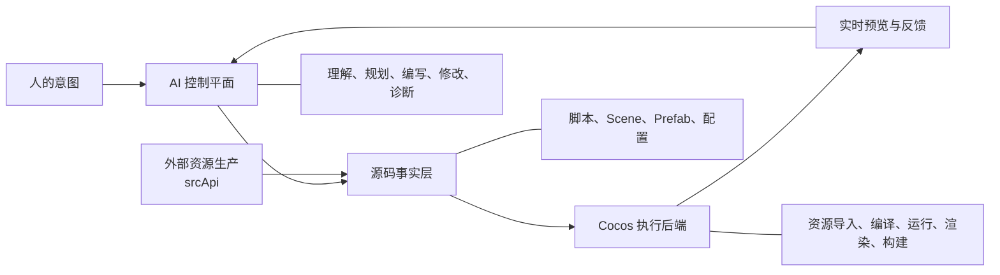

# Kurenai Studio 技术设计

## 1. 文档目的

Kurenai Studio 不是一个由 AI 远程操作的 Cocos Creator，也不是给传统编辑器增加一个聊天窗口。

它尝试建立一种新的游戏开发架构：

> AI 直接维护工程源码，源码是唯一事实来源，游戏引擎退回为可替换的确定性编译与执行后端。

这套架构的重点不是把现有编辑器操作自动化，而是减少开发系统对编辑器、Editor API 和隐藏状态的依赖。

## 2. 核心判断

传统游戏开发通常以引擎编辑器为中心：

```text
开发者
→ 操作 Hierarchy、Inspector 和菜单
→ 编辑器修改内存中的场景状态
→ 编辑器保存工程文件
→ 引擎编译并运行
```

Kurenai 将流程改为：

```text
人提出意图
→ AI 理解、规划并修改工程源码
→ 引擎导入、编译和运行
→ Kurenai 展示预览、节点和错误
→ AI 根据反馈继续修改
```

这里发生了两次关键转移：

1. 开发入口从引擎编辑器转移到 AI。
2. 项目状态从编辑器内存转移到磁盘源码。

## 3. 总体架构



系统由五个主要部分组成：

### 3.1 人的意图

人负责提出目标、判断体验和接受结果，不再需要把需求翻译成大量编辑器操作。

### 3.2 AI 控制平面

DSH 和 Agent 构成开发控制平面，负责：

- 理解需求和工程上下文。
- 规划修改步骤。
- 编写或修改脚本。
- 修改 Scene、Prefab 和配置。
- 组织资源引用。
- 分析编译错误和运行结果。
- 根据预览反馈持续迭代。

AI 是工程的作者，但不是游戏运行时。

### 3.3 源码事实层

磁盘中的工程文件是唯一事实来源，包括：

- TypeScript/JavaScript 脚本。
- Scene 和 Prefab。
- 资源与 `.meta` 文件。
- 项目配置。
- Agent 编写规则和 Skill。

所有有效修改都必须最终固化到源码。对浏览器运行时或编辑器内存的临时修改不能作为交付结果。

### 3.4 引擎执行后端

Cocos 不再负责组织开发流程，只保留其不可替代的确定性能力：

- 资源导入和依赖解析。
- UUID、Class ID 和组件注册。
- 脚本与资源编译。
- Scene/Prefab 反序列化。
- 渲染、布局、动画、物理和音频执行。
- 平台构建。
- 提供真实预览和错误信息。

因此，Cocos 在本架构中的准确定位不是单纯的“资源管理工具”，而是：

> 资源编译器、游戏运行时和结果验证器。

### 3.5 外部资源生产

图片、音频、Spine、模型和其他原始资源由独立系统生产。未来 `srcApi` 将作为资源生产与处理入口接入 Kurenai。

资源生产层负责：

- 调用生成模型或 DCC 工具。
- 保存提示词、来源和授权信息。
- 格式转换与压缩。
- 批量生产、缓存和重试。
- 输出资源文件和结构化清单。

Kurenai 负责把资源导入项目并建立引用；Headless Cocos 负责执行正式导入和编译。

## 4. 为什么不围绕 Editor API 建设

Editor API 操作的是一个有状态编辑器，通常依赖：

- Creator 进程已经启动。
- 正确场景已经打开。
- 当前选择、焦点和编辑模式正确。
- 内存状态与磁盘状态一致。
- 场景成功保存且没有 dirty 冲突。
- 当前 Creator 版本仍支持对应接口。

如果为 AI 包装大量 Editor API，就需要持续维护：

- 创建和删除节点工具。
- Inspector 属性修改工具。
- 场景保存和切换工具。
- Editor Message 桥接。
- MCP 参数和返回值定义。
- 不同 Creator 版本的兼容层。

这些工作本质上是在为 AI 复刻一套人类编辑器操作接口。

Kurenai 的战略判断是：随着 AI 对代码和结构化文件的理解能力增强，这类接口会逐渐成为过渡性基础设施。相比之下，直接维护源码具有以下长期优势：

- 修改结果可比较、可审查。
- 可以回滚和复现。
- 不依赖编辑器是否运行。
- 崩溃或重启不会丢失内存状态。
- 同一流程可以用于单次修改、批量任务和自动化测试。
- Agent 能从工程文件重新恢复上下文。

因此，系统优先建设“源码修改—编译验证—预览反馈”闭环，而不是“AI—Editor API—编辑器状态”调用链。

## 5. “不使用引擎 API”的准确含义

本设计所说的不使用引擎 API，主要指：

> 不依赖 Cocos Editor API 完成工程创作和场景编排。

它不代表游戏代码不使用 Cocos Runtime API。业务脚本仍然可以使用 `Node`、`Component`、动画、物理、音频和渲染等运行时能力。

需要区分：

- **不作为开发入口**：Editor API、Hierarchy、Inspector、菜单操作。
- **继续作为执行能力**：Runtime API、资源导入、编译、渲染和构建。

AI 接管的是创作与编排工作，不是引擎的确定性执行职责。

## 6. 为什么当前执行后端选择 Cocos

Cocos 被保留，不是因为 Kurenai 需要 Cocos Creator 编辑器，而是因为当前业务需要其已经建立的运行时契约：

- 现有 Cocos 项目和资源可以继续使用。
- TypeScript/JavaScript 是成熟开发路径。
- Scene、Prefab、Node 和 Component 模型完整。
- 2D UI、Spine、动画、图集和移动端适配已经验证。
- Web 和试玩广告构建链路成熟。
- 团队已有相关工程经验和资产积累。

如果改为 Three.js，需要重新建设场景格式、组件系统、资源依赖、2D UI、Spine、脚本生命周期、构建和平台适配。Three.js 更接近渲染库，不是当前 Cocos 工程的直接替代品。

Godot 是更完整的候选后端，具有开源、文本场景格式和官方 Headless 工作流等优势。但当前仍需要承担现有项目迁移、脚本语言变化、WebAssembly 包体、移动浏览器兼容和资源生态重建成本。

因此：

> Cocos 是当前最经济的执行后端，不是系统永久绑定的唯一引擎。

## 7. 这套架构的技术赌注

本架构明确押注以下趋势：

1. AI 的代码理解和修改能力会持续提升。
2. AI 将能够直接维护越来越复杂的软件工程。
3. 为 AI 复刻人类编辑器操作接口的长期价值会下降。
4. 快速、确定性的编译和运行反馈会比大量操作 API 更重要。

这意味着应减少投入：

- UI 自动化。
- Editor API 包装。
- 针对编辑器状态的复杂 MCP 工具。
- 每个引擎版本重复维护的操作适配层。

应持续投入：

- 清晰、稳定的工程格式。
- 项目规则和上下文。
- Schema、引用和资源校验。
- 快速增量编译。
- 实时预览和诊断。
- 修改事务、回滚和自动测试。

这不是赌 AI 可以在没有约束的情况下完成一切，而是赌：

> AI 能够直接维护一个结构透明、规则明确、反馈充分的软件工程。

## 8. 为什么不能让 AI 无约束地修改文件

直接修改源码不等于允许模型任意重写 Scene JSON。

Cocos 工程仍包含严格约束：

- Scene 和 Prefab 的序列化结构。
- 节点、组件和资源引用关系。
- `.meta` UUID。
- 自定义组件的压缩 Class ID。
- 资源导入后的依赖信息。

因此源码级开发仍然需要确定性保障：

- 结构化编辑与最小修改。
- Schema 校验。
- 稳定 ID 管理。
- 编译结果验证。
- 引用完整性检查。
- 修改前后的差异审查。
- 失败回滚。

这些能力可以由轻量源码工具、规则和测试实现，但不应重新演化成一套必须依赖 Creator Editor 的操作系统。

## 9. Kurenai 的反馈闭环

一次标准修改流程如下：

1. 用户在预览或节点树中选择对象。
2. Kurenai 获取节点路径、组件和运行信息。
3. 选择信息进入当前 DSH 会话上下文。
4. 用户用自然语言描述目标。
5. Agent 读取工程规则并修改源文件。
6. Headless Cocos 检测变化并重新编译。
7. 预览刷新，展示真实运行结果。
8. 编译错误、运行异常和视觉结果返回给 Agent。
9. Agent 继续修正，直到用户接受结果。

这个闭环中，Kurenai 不负责代替 AI 编写业务内容；它负责提供上下文、启动执行后端和缩短反馈时间。

## 10. 外部资源生产与 srcApi

资源生产应该与游戏工程编排解耦。

计划中的 `srcApi` 接入后，推荐使用标准资源包契约。一个资源包至少应包含：

- 原始或处理后的资源文件。
- 资源类型和用途。
- 推荐名称与目录。
- 尺寸、分辨率或骨骼信息。
- 生成来源与授权信息。
- 可选的导入参数。
- 文件校验值。

推荐流程：

```text
用户或 Agent 提出资源需求
→ srcApi 生产和处理资源
→ 输出资源包与清单
→ Kurenai 合并到项目
→ Headless Cocos 导入和编译
→ 预览验证
```

这样可以独立更换资源模型、供应商或 DCC 工具，而不影响项目开发架构。

## 11. 长期演进方向

Kurenai 的上层开发流程不应永久绑定 Cocos。未来可以把执行后端抽象为统一生命周期：

```text
识别工程
→ 导入资源
→ 编译
→ 启动预览
→ 获取场景投影
→ 收集错误
→ 停止运行
```

在这一边界下，可以逐步验证：

- Cocos 后端。
- Godot 后端。
- Three.js 或其他 Web Runtime 后端。

上层仍然保持“AI 控制平面 + 源码事实层”，不同引擎只负责各自的确定性编译和执行。

## 12. 设计原则总结

Kurenai Studio 遵循以下原则：

1. **AI 是作者**：理解需求并直接修改工程。
2. **源码是事实**：交付结果必须存在于磁盘工程中。
3. **引擎是后端**：负责资源、编译、运行、渲染和构建。
4. **预览是反馈**：运行结果用于验证，而不是保存隐藏状态。
5. **资源生产外置**：通过独立系统生产，通过契约进入工程。
6. **确定性能力长期保留**：校验、编译、测试和回滚不会被模型能力替代。
7. **编辑器自动化保持最小化**：避免把长期投入绑定在过渡性交互方式上。

最终目标不是让 AI 更熟练地操作传统编辑器，而是让传统编辑器不再成为游戏开发的必要中心。
